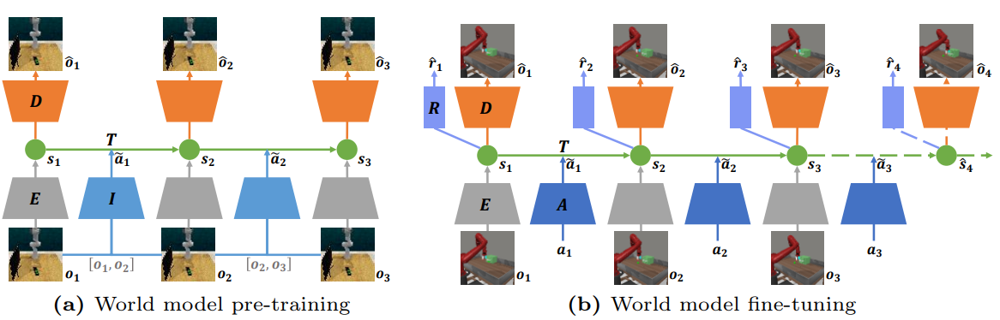

# PreLAR: World Model Pre-training with Learnable Action Representation (ECCV 2024)

Official implementation of the PreLAR: World Model Pre-training with Learnable Action Representation in PyTorch.

If you find our codebase useful for your research, please cite our paper as:

```
@inproceedings{zhang2024prelar,
  title={PreLAR: World Model Pre-training with Learnable Action Representation},
  author={Zhang, Lixuan and Kan, Meina and Shan, Shiguang and Chen, Xilin},
  booktitle={European Conference on Computer Vision},
  pages={185--201},
  year={2024},
  organization={Springer}
}
```

## Method

We introduce PreLAR, an action-conditional world model pre-training scheme based on action-free videos to sample-efficient model-based RL of visual control tasks.

<div align="center"></div>

## Dependencies

The conda environment can be created by the following command:
```
conda env create -f environment.yaml
conda activate PreLAR
```

**Meta-world**

Meta-world depends on [MuJoCo200](https://www.roboti.us/download.html). You need to install it manually.
Meta-world itself can be installed using the following command:
```
pip install git+https://github.com/rlworkgroup/metaworld.git@a0009ed9a208ff9864a5c1368c04c273bb20dd06#egg=metaworld
```
If the above installation fails, you can clone the Metaworld repository and install it manually.
```
git clone https://github.com/Farama-Foundation/Metaworld.git
git checkout v2.0.0
pip install .
```

## Datasets

**Something-Something-V2**

Download the [Something-Something-V2](https://developer.qualcomm.com/software/ai-datasets/something-something) dataset and extract frames of videos (Note that you should properly specify data paths in this script):

```
cd data/somethingv2
python extract_frames.py
```

Then you can generate data lists by the following command (also, properly specify data paths): 

```
python process_somethingv2.py
```

The generated lists have already included in this repo (see `data/somethingv2/*.txt`).

## Pre-trained Models

We provide our pre-trained world models:

- PreLAR pre-trained on [RLBench dataset from APV](https://drive.google.com/drive/folders/1Qk9fvC1OGxrbVFGm0zrPmAmV8lu4_l8D) and Something-Something-V2.

You can obtain them from [[Google Drive](https://drive.google.com/file/d/1XWx6ahsPdRZr7OCHC2SAOpqk9qBBQDJD/view?usp=sharing)].

## Experiments

### Pre-training World Model with Learnable Action Representation
Modify the `video_dirs` parameters in `configs/*_pretraing.yaml`
e.g.
```
rlbench_pretrain:
 task: metaworld_door_open
 video_dirs: {rlbench: ./dataset/rlbench/train_episodes}

something_pretrain:
 task: metaworld_door_open
 video_dirs: {something: ./dataset/Something-Something/20bn-something-something-v2-frames-64}

```
Run the following command to pre-train world models.

**RLBench**

```
python examples/train_prelar_pretraining.py --logdir ${log_save_path} --configs rlbench_pretrain --steps 600000 --save_all_models True --precision 32 --vanet.type_ stoch --vanet.discrete 0 --vanet.stoch 64 --rank_loss sign --wandb.mode offline
```
e.g.
```
python examples/train_prelar_pretraining.py --logdir  log0101-prelar-rlbench-sign --configs rlbench_pretrain --steps 600000 --save_all_models True --precision 32 --vanet.type_ stoch --vanet.discrete 0 --vanet.stoch 64 --rank_loss sign --wandb.mode offline
```

**Something-Something-V2**

```
python examples/train_prelar_pretraining.py --logdir ${log_save_path} --configs something_pretrain --steps 600000 --save_all_models True --precision 32 --vanet.type_ stoch --vanet.discrete 0 --vanet.stoch 64 --rank_loss sign --wandb.mode offline 
```
e.g.
```
python examples/train_prelar_pretraining.py --logdir log0101-prelar-s2s-sign --configs something_pretrain --steps 600000 --save_all_models True --precision 32 --vanet.type_ stoch --vanet.discrete 0 --vanet.stoch 64 --rank_loss sign --wandb.mode offline 
```

### Fine-tuning World Model with Real Action

Run the following commands to fine-tune world models.

**Meta-world**
```
python examples/train_prelar_finetuning.py --logdir ${log_save_path} --configs metaworld --task metaworld_${task} --seed ${seed} --loss_scales.reward 1.0 --loss_scales.aux_reward 1.0 --load_logdir ${path_to_the pre-trained_models} --action_encoder.type_ deter --action_encoder.deter 64 --wandb.mode offline
```
e.g.
```
python examples/train_prelar_finetuning.py --logdir log0101-prelar-rlbench-metaworld_drawer_open0 --configs metaworld --task metaworld_drawer_open --seed 0 --loss_scales.reward 1.0 --loss_scales.aux_reward 1.0 --load_logdir ./pre-train_models/log0101-prelar-rlbench-sign --action_encoder.type_ deter --action_encoder.deter 64 --wandb.mode offline
```

### Baselines

We include unified implementations for our baseline methods [DreamerV2](https://github.com/danijar/dreamerv2) and [APV](https://github.com/younggyoseo/apv), which can also be easily run by the following commands.

**DreamerV2**

```
python examples/train_dreamerv2.py --logdir ${log_save_path} --configs metaworld --task metaworld_${task} --seed ${seed} --steps 256000 --precision 32 --wandb.mode offline
```
e.g.
```
python examples/train_dreamerv2.py --logdir log0101-dreamerv2-metaworld_drawer_open0 --configs metaworld --task metaworld_drawer_open --seed 0 --steps 256000 --precision 32 --wandb.mode offline
```

**APV**

```
python examples/train_apv_pretraining.py --logdir ${log_save_path} --configs rlbench_pretrain --steps 600000 --save_all_models True --precision 32
```
e.g.
```
python examples/train_apv_pretraining.py --logdir log0101-apv-rlbench --configs rlbench_pretrain --steps 600000 --save_all_models True --precision 32
```


```
python examples/train_apv_finetuning.py --logdir ${log_save_path} --configs metaworld --task metaworld_${task} --seed ${seed} --loss_scales.reward 1.0 --loss_scales.aux_reward 1.0 --load_logdir ${path_to_the pre-trained_models} --wandb.mode offline
```
e.g.
```
python examples/train_apv_finetuning.py --logdir log0101-apv-rlbench-metaworld_drawer_open0 --configs metaworld --task metaworld_drawer_open --seed 0 --loss_scales.reward 1.0 --loss_scales.aux_reward 1.0 --load_logdir ./pre-train_models/log0101-apv-rlbench --wandb.mode offline
```

**ContextWM**

```
python examples/train_apv_pretraining.py --logdir ${log_save_path} --configs rlbench_pretrain contextualized --steps 600000 --save_all_models True --precision 32
```
e.g.
```
python examples/train_apv_pretraining.py --logdir log0101-context-rlbench --configs rlbench_pretrain contextualized --steps 600000 --save_all_models True --precision 32
```


```
python examples/train_apv_finetuning.py --logdir ${log_save_path} --configs metaworld contextualized --task metaworld_${task} --seed ${seed} --loss_scales.reward 1.0 --loss_scales.aux_reward 1.0 --load_logdir ${path_to_the pre-trained_models} --wandb.mode offline
```
e.g.
```
python examples/train_apv_finetuning.py --logdir log0101-context-rlbench-metaworld_drawer_open0 --configs metaworld contextualized --task metaworld_drawer_open --seed 0 --loss_scales.reward 1.0 --loss_scales.aux_reward 1.0 --load_logdir ./pre-train_models/log0101-context-rlbench --wandb.mode offline
```

## Variants

**Naive Fine-tune**
```
python examples/train_naive_finetune.py --logdir ${log_save_path} --configs metaworld --task metaworld_${task} --seed ${seed} --loss_scales.reward 1.0 --beta 0 --loss_scales.aux_reward 0 --load_logdir ${path_to_the pre-trained_models} --wandb.mode offline
```
e.g.
```
python examples/train_naive_finetune.py --logdir log0101-apv_naive-rlbench-metaworld_drawer_open0 --configs metaworld --task metaworld_drawer_open --seed 0 --loss_scales.reward 1.0 --beta 0 --loss_scales.aux_reward 0  --load_logdir ./pre-train_models/log0101-apv-rlbench --wandb.mode offline
```

**PreLAR (Naive Fine-tune setting)** 
```
python examples/train_prelar_finetuning.py --logdir ${log_save_path} --configs metaworld --task metaworld_${task} --seed ${seed} --loss_scales.reward 1.0 --beta 0 --loss_scales.aux_reward 0 --load_logdir ${path_to_the pre-trained_models} --action_encoder.type_ deter --action_encoder.deter 64 --wandb.mode offline
```
e.g.
```
python examples/train_prelar_finetuning.py --logdir log0101-prelar-rlbench-metaworld_drawer_open0 --configs metaworld --task metaworld_drawer_open --seed 0 --loss_scales.reward 1.0 --beta 0 --loss_scales.aux_reward 0 --load_logdir ./pre-train_models/log0101-prelar-rlbench-sign --action_encoder.type_ deter --action_encoder.deter 64 --wandb.mode offline
```

**PreLAR w/o CL**

```
python examples/train_prelar_wo_cl_pretraining.py --logdir  ${log_save_path} --configs rlbench_pretrain --steps 600000 --save_all_models True --precision 32 --vanet.type_ stoch --vanet.discrete 0 --vanet.stoch 64 --wandb.mode offline
```
e.g.
```
python examples/train_prelar_wo_cl_pretraining.py --logdir log0101-prelar_wo_cl-rlbench --configs rlbench_pretrain --steps 600000 --save_all_models True --precision 32 --vanet.type_ stoch --vanet.discrete 0 --vanet.stoch 64 --wandb.mode offline
```

```
python examples/train_prelar_finetuning.py --logdir ${log_save_path} --configs metaworld --task metaworld_${task} --seed ${seed} --loss_scales.reward 1.0 --loss_scales.aux_reward 1.0 --load_logdir ${path_to_the pre-trained_models} --action_encoder.type_ deter --action_encoder.deter 64 --wandb.mode offline
```
e.g.
```
python examples/train_prelar_finetuning.py --logdir log0101-prelar_wo_cl-rlbench-metaworld_drawer_open0 --configs metaworld --task metaworld_drawer_open --seed 0 --loss_scales.reward 1.0 --loss_scales.aux_reward 1.0 --load_logdir ./pre-train_models/log0101-prelar_wo_cl-rlbench --action_encoder.type_ deter --action_encoder.deter 64 --wandb.mode offline
```

**PreLAR w/o AL & CL**

```
python examples/train_prelar_wo_cl_pretraining.py --logdir  ${log_save_path} --configs rlbench_pretrain --steps 600000 --save_all_models True --precision 32 --vanet.type_ deter --vanet.deter 64 --wandb.mode offline
```
e.g.
```
python examples/train_prelar_wo_cl_pretraining.py --logdir log0101-prelar_wo_al_cl-rlbench --configs rlbench_pretrain --steps 600000 --save_all_models True --precision 32 --vanet.type_ deter --vanet.deter 64 --wandb.mode offline
```

```
python examples/train_prelar_finetuning.py --logdir ${log_save_path} --configs metaworld --task metaworld_${task} --seed ${seed} --loss_scales.reward 1.0 --loss_scales.aux_reward 1.0 --load_logdir ${path_to_the pre-trained_models} --action_encoder.type_ deter --action_encoder.discrete 0 --action_encoder.stoch 64 --action_encoder.deter 64 --wandb.mode offline
```
e.g.
```
python examples/train_prelar_finetuning.py --logdir log0101-prelar_wo_al_cl-rlbench-metaworld_drawer_open0 --configs metaworld --task metaworld_drawer_open --seed 0 --loss_scales.reward 1.0 --loss_scales.aux_reward 1.0 --load_logdir ./pre-train_models/log0101-prelar_wo_al_cl-rlbench --action_encoder.type_ deter --action_encoder.deter 64 --wandb.mode offline
```

## Tips

Mixed precision is enabled by default, which is faster but can probably cause numerical instabilities. It is normal to encounter infinite gradient norms, and the training may be interrupted by `nan` values. You can pass `--precision 32` to disable mixed precision.

See also the tips available in [ContextWM repository](https://github.com/thuml/ContextWM) and [DreamerV2 repository](https://github.com/danijar/dreamerv2).

## Contact

If you have any questions, please contact lixuan.zhang@vipl.ict.ac.cn

## Acknowledgement

We sincerely appreciate the following GitHub repos for their valuable code base we build upon:

- https://github.com/thuml/ContextWM
- https://github.com/younggyoseo/apv
- https://github.com/danijar/dreamerv2
- https://github.com/esteveste/dreamerV2-pytorch
